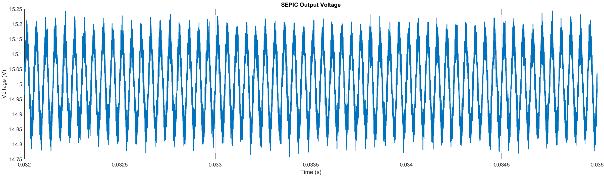
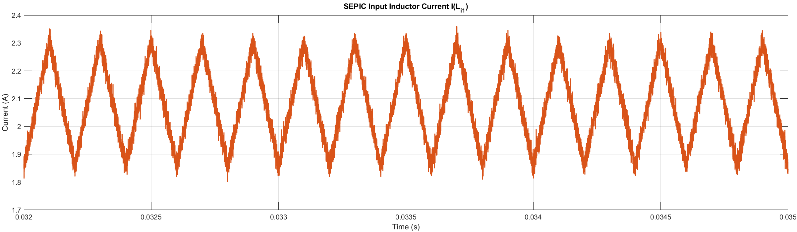
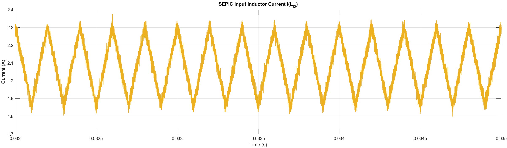
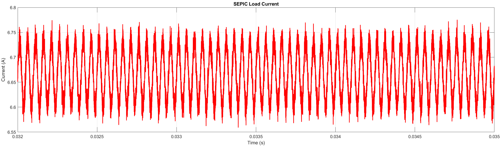
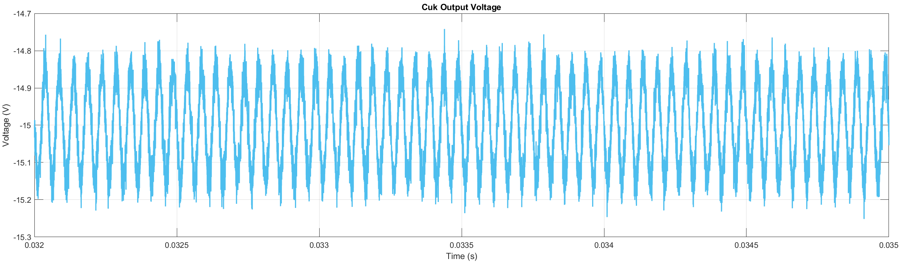
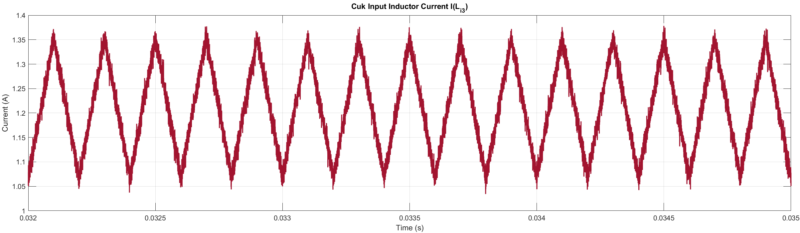
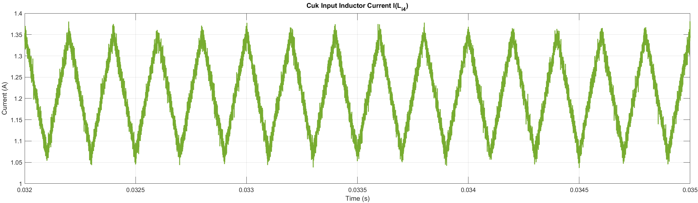
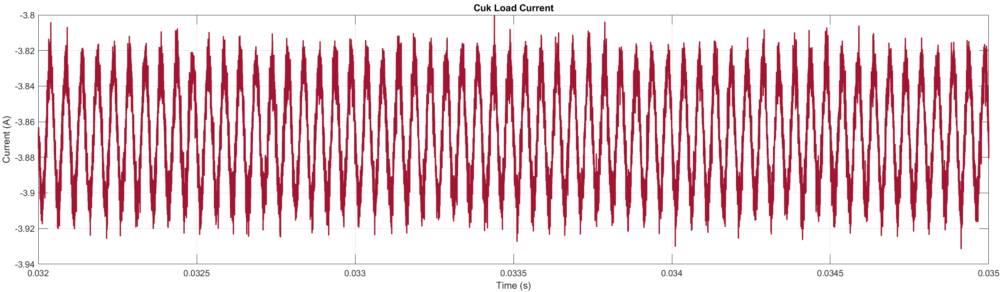

# 4-Phase Interleaved Cuk-SEPIC Converter — Simulink Model

## Overview
This repository contains a Simulink model of a **4-phase interleaved Cuk-SEPIC** DC–DC converter designed to convert a 12 V DC input into split-rail outputs of **+15 V and -15 V**. The model includes switching MOSFETs, input inductors, coupling/transfer capacitors, output filters, diodes, PWM gating, and measurement blocks. The project also contains waveform screenshots produced from the simulation.

The model was built at a switching frequency of **5 kHz**.

---

## Repository contents
- `model/` — (Simulink files) the full Simulink model files (.slx/.mdl).  
- `Images/` — waveform images exported from the simulation (see list below).  
- `README.md` — this file.  
- `docs/` — optional supporting documentation (if present).

---

## Simulink Model & Model parameters

| Component / Parameter | Name in model | Value used |
|---|---:|---:|
| Input voltage | `V_in` | **12 V** |
| Output voltage (target) | `V_out+`, `V_out-` | **+15 V, -15 V** |
| Switching frequency | `f_s` | **5 kHz** |
| Input inductors (SEPIC) | `L_i1, L_i2` | **3.0 mH** |
| Coupling capacitors (SEPIC) | `C_i1, C_i2` | **180 µF** |
| Output inductors (SEPIC) | `L_o1, L_o2` | **10.0 mH** |
| Output capacitor (SEPIC) | `C_o` | **250 µF** |
| Input inductors (Cuk) | `L_i3, L_i4` | **4.7 mH** |
| Transfer capacitors (Cuk) | `C_i3, C_i4` | **39 µF** |
| Output inductors (Cuk) | `L_o3, L_o4` | **12.0 mH** |
| Output capacitor (Cuk) | `C_o1` | **250 µF** |

---

## Waveform Results

| Filename | Description |
|---|---|
| `SEPIC_Output_Voltage.png` | The output voltage waveform of the SEPIC converter (+15V). |
| `SEPIC_ILi1.png` | The current waveform through the first input inductor (L_i1) of the SEPIC. |
| `SEPIC_ILi2.png` | The current waveform through the second input inductor (L_i2) of the SEPIC. |
| `SEPIC_Lo1.png` | The current waveform through the first output inductor (L_o1) of the SEPIC. |
| `SEPIC_Lo2.png` | The current waveform through the second output inductor (L_o2) of the SEPIC. |
| `SEPIC_Load_Current.png` | The total current waveform through the SEPIC's load resistor. |
| --- | --- |
| `Cuk_Output_Voltage.png` | The output voltage waveform of the Cuk converter (-15V). |
| `Cuk_ILi3.png` | The current waveform through the first input inductor (L_i3) of the Cuk. |
| `Cuk_ILi4.png` | The current waveform through the second input inductor (L_i4) of the Cuk. |
| `Cuk_Lo3.png` | The current waveform through the first output inductor (L_o3) of the Cuk. |
| `Cuk_Lo4.png` | The current waveform through the second output inductor (L_o4) of the Cuk. |
| `Cuk_Load_Current.png` | The total current waveform through the Cuk's load resistor. |

---

## Figure Captions & Commentary

  
**SEPIC output voltage.** Average ~15 V, ripple small due to filtering.

  
**SEPIC Input Inductor (L_i1) current.** Average ~2.08 A.

  
**SEPIC Input Inductor (L_i2) current.** Average ~2.08 A.

  
**SEPIC Output Inductor (L_o1) current.** Average ~1.67 A.

  
**SEPIC Output Inductor (L_o2) current.** Average ~1.67 A.

  
**SEPIC load current.** Derived from +15 V output rail.  

---

  
**Cuk output voltage.** Average ~-15 V, ripple small due to filtering.

  
**Cuk Input Inductor (L_i3) current.** Average ~1.21 A.

  
**Cuk Input Inductor (L_i4) current.** Average ~1.21 A.

  
**Cuk Output Inductor (L_o3) current.** Average ~0.97 A.

  
**Cuk Output Inductor (L_o4) current.** Average ~0.97 A.

  
**Cuk load current.** Derived from -15 V output rail.

---

## Device selection & stress checks
- **MOSFETs:** Voltage ≥ (V_in + |V_out|) and current ≥ peak inductor current.  
- **Diodes:** Reverse-block ≥ (V_in + |V_out|), current ≥ peak inductor current.  
- **Inductors:** Must handle respective average and ripple currents.  
- **Capacitors:** Low ESR, handle ripple at switching frequency.

---

## Known issues
- Running at 5 kHz requires relatively large L and C values (already applied).  
- MOSFET/diode device models are not included; stress analysis must be done for real hardware selection.

---

## Author / Contact
- Author: *Your Name*  
- Contact: *your.email@domain*  

---

## License
MIT License
