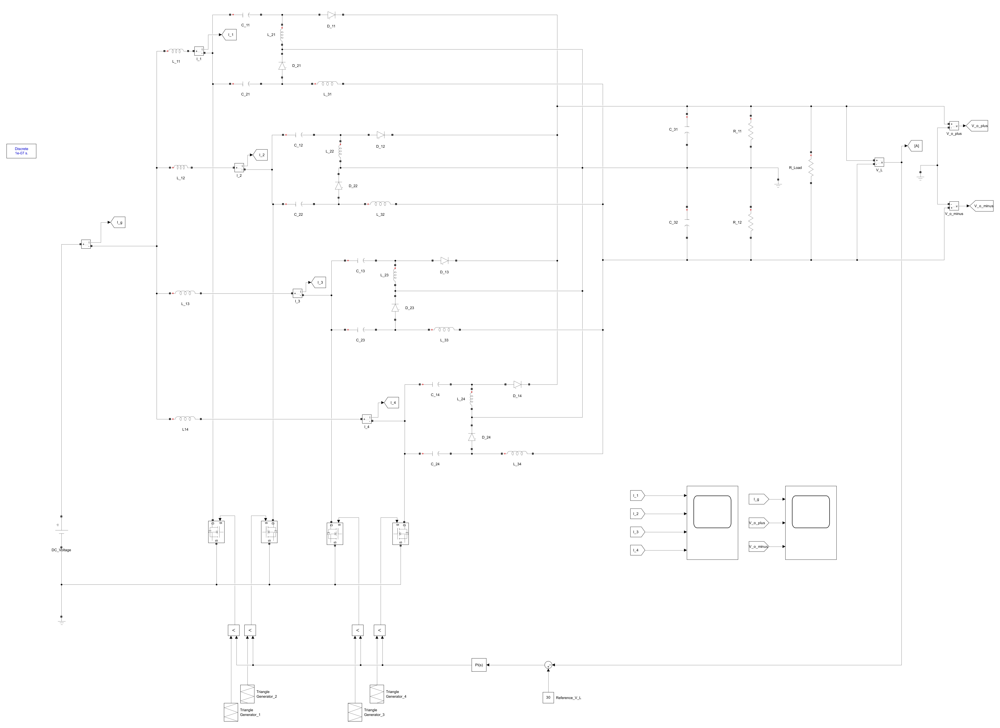
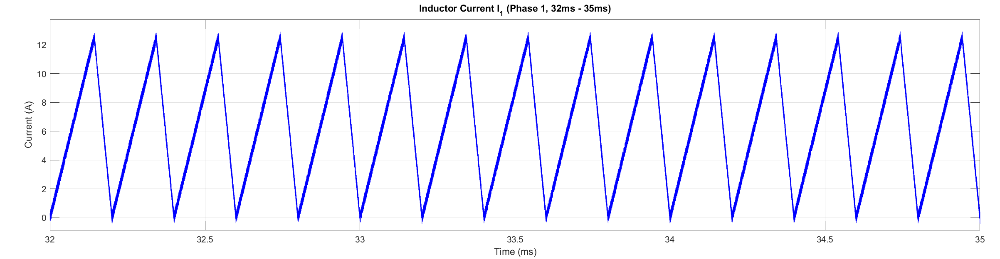
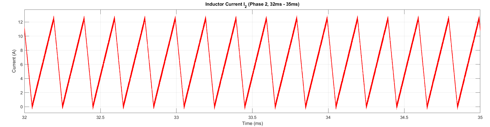
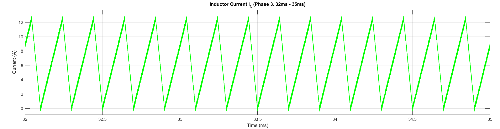
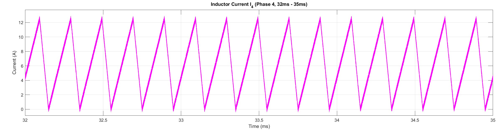
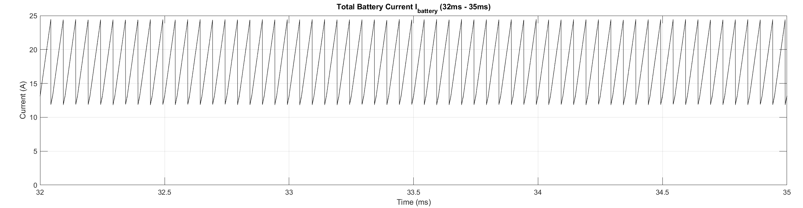
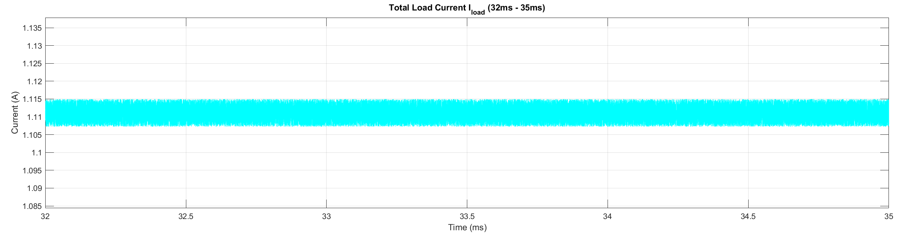
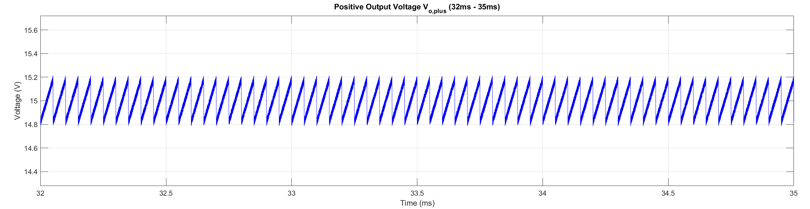
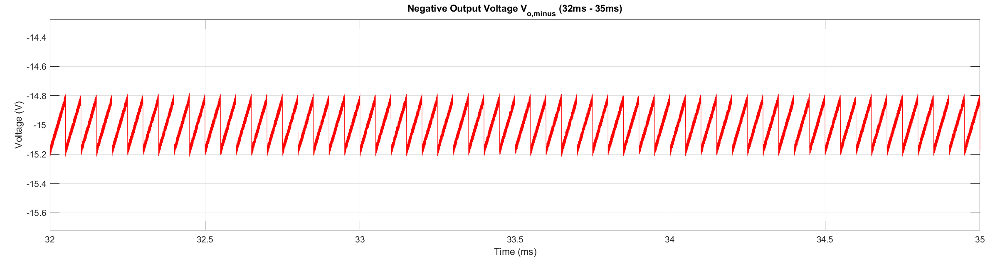

# 4-Phase Interleaved Cuk-SEPIC Converter — Simulink Model

## Overview
This repository contains a Simulink model of a **4-phase interleaved Cuk-SEPIC** DC–DC converter designed to boost 12 V to 30 V using four interleaved power stages. The model includes switching MOSFETs, input inductors, coupling capacitors, output filter, diodes, control (PWM generation / gating), and measurement blocks. The project also contains waveform screenshots produced from the simulation.

The model was built at a switching frequency of **100 kHz** (see “Notes” below). A user originally requested 5 kHz, but the model’s component values match a 100 kHz design — that mismatch is the main cause of any L/C discrepancy if you try to use it at 5 kHz.

---

## Repository contents
- `model/` — (Simulink files) the full Simulink model files (.slx/.mdl).  
- `Images/` — waveform images exported from the simulation:
  - `I1_waveform.png`
  - `I2_waveform.png`
  - `I3_waveform.png`
  - `I4_waveform.png`
  - `I_battery_waveform.png`
  - `I_load_waveform.png`
  - `Vo_plus_waveform.png`
  - `Vo_minus_waveform.png`
- `README.md` — this file.
- `docs/` — optional supporting documentation (if present).

---

## Simulink Model & Model parameters

| Component / Parameter | Name in model | Value used |
|---|---:|---:|
| Input voltage | `V_in` | **12 V** |
| Output voltage (target) | `V_out` | **30 V** |
| Load resistor | `R_load` | **27 Ω** |
| Switching frequency | `f_s` | **100 kHz** |
| Duty cycle | `D` | **~71.4% (implicit — set by control loop to reach 30 V)** |
| Input inductors (per phase) | `L_11, L_12, L_13, L_14` | **137 μH** |
| Coupling / switching capacitors | `C_11, C_21, etc.` | **22 μF** |
| MOSFET & diode stresses | `V_ds`, `I_d(peak)`, `V_r(max)`, `I_f(peak)` | **Not specified in model (N/A)** — select devices with adequate voltage/current margin (see notes) |

---

## Waveform Results

| Filename | Description | Peak Value (Max) | Average (DC) | Peak-to-Peak Ripple |
|---|---|---:|---:|---:|
| `Images/I1_waveform.png` | Inductor Current (Phase 1) | ~12.5 A | Varies (DCM) | ~12.5 A |
| `Images/I2_waveform.png` | Inductor Current (Phase 2) | ~12.5 A | Varies (DCM) | ~12.5 A |
| `Images/I3_waveform.png` | Inductor Current (Phase 3) | ~12.5 A | Varies (DCM) | ~12.5 A |
| `Images/I4_waveform.png` | Inductor Current (Phase 4) | ~12.5 A | Varies (DCM) | ~12.5 A |
| `Images/I_battery_waveform.png` | Total Battery Current | ~12.5 A | ~2.78 A | ~12.5 A |
| `Images/I_load_waveform.png` | Total Load Current | ~1.12 A | ~1.11 A | ~0.013 A |
| `Images/Vo_plus_waveform.png` | Positive Output Voltage | ~15.18 V | ~15 V | ~0.36 V |
| `Images/Vo_minus_waveform.png` | Negative Output Voltage | -14.82 V | ~-15 V | ~0.36 V |

---

## Figure Captions & Commentary

**Phase-1 inductor current (I1).** Peaks at ~12.5 A, operating in DCM (discontinuous conduction mode), with ~12.5 A peak-to-peak ripple.

 
**Phase-2 inductor current (I2).** Similar to I1, interleaved by 90°. Ripple ~12.5 A. Helps cancel input ripple when combined with other phases.

**Phase-3 inductor current (I3).** Shows balanced current sharing. Ripple ~12.5 A.

  
**Phase-4 inductor current (I4).** Completes 4-phase pattern. Ripple ~12.5 A.

 
**Input battery/source current.** Peak ~12.5 A, average ~2.78 A. Ripple magnitude ~12.5 A, reduced compared to single-phase due to interleaving.

  
**Load current waveform.** Average ~1.11 A at 30 V / 27 Ω. Ripple small (~13 mA), indicating good output filtering.

  
**Output positive rail voltage.** Average ~15 V (half of 30 V differential), ripple ~0.36 V.

 
**Output negative rail voltage.** Average ~-15 V, ripple ~0.36 V.

---

## Design / scaling notes (100 kHz vs 5 kHz)
The model components are sized for 100 kHz operation. If you want to run the same converter at **5 kHz**, inductance and capacitance must be increased to keep ripple levels similar:

- Scaling factor = 100 kHz / 5 kHz = 20.  
- New L ≈ 137 μH × 20 = **2.74 mH** (per phase).  
- New C ≈ 22 μF × 20 = **440 μF**.  

---

## Device selection & stress checks
- **MOSFETs:** Voltage ≥ (V_in + V_out) and current ≥ peak inductor current.  
- **Diodes:** Reverse-block ≥ (V_in + V_out), current ≥ peak inductor current.  
- **Inductors:** Core must withstand peak ~12.5 A per phase.  
- **Capacitors:** Low ESR, handle ~0.36 V ripple at output.

---

## Known issues
- Running at 5 kHz with 137 μH / 22 μF will cause **excessive ripple**.  
- MOSFET/diode device models are not included; stress analysis must be done for real hardware selection.

---

## Author / Contact
- Author: *Your Name*  
- Contact: *your.email@domain*  

---

## License
MIT License
